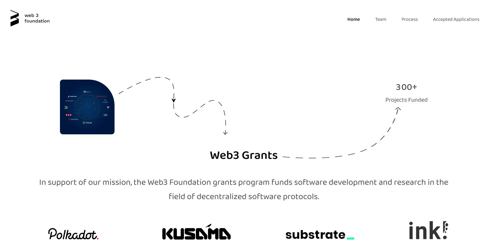
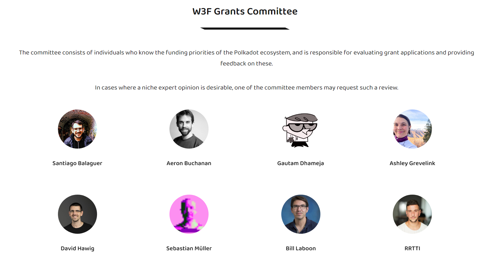
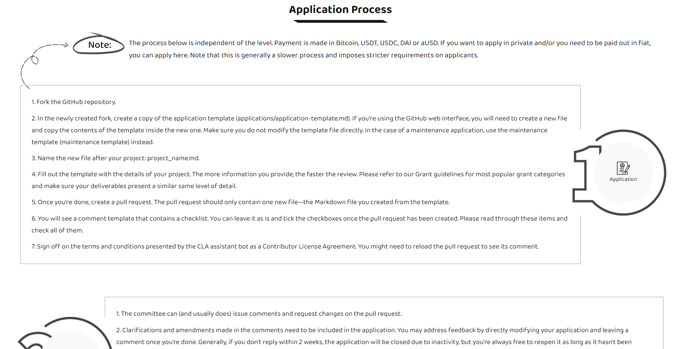
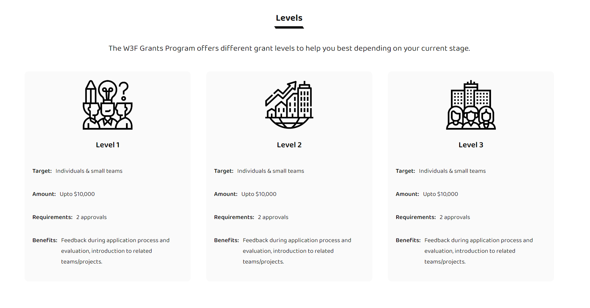

# React-Web3Foundations

Link to the live web application => (https://react-web3funds.web.app) \
A Frontend, React based Web-application.\
It is another one of my freelancing projects which displays information about Grants provided by Web3Foundation team.\

Some of the features:
1. The application includes a search bar and very complex filtering options for hundreds of data of granted applications.
2. It is completely responsive i.e. mobile friendly.
3. Fully animated using javascript libraries such as AOS and Framer Motion.
4. It uses data scraped by using Javascript library Puppeteer in Node js.
5. All of the styling is done in Sass.

This project tested all of my React knowledge. Had a lot of fun making this project come to life and learned alot.\

## Here's how it looks-like

## Here are some of the Clips

https://user-images.githubusercontent.com/78212328/175658075-bf3fb4e6-3cfe-4c98-bfba-a226098aec07.mp4

https://user-images.githubusercontent.com/78212328/175658839-b31cfe34-98a9-4b9d-bcbb-b35697efa16c.mp4

https://user-images.githubusercontent.com/78212328/175658907-d4dc0f99-28e7-4e36-9df9-eac33be99e35.mp4

https://user-images.githubusercontent.com/78212328/175658921-949ab7c9-3136-4dfd-9e58-ae61b0facd94.mp4

## How to Run the project on your Device

First step is install latest version of Nodejs on your device.\
Clone/fork the repository or download zipped code files.\
In the project directory, you can run:

### `npm install`

Runs the node pakage manager (npm) and installs the dependencies of the project.

### `npm audit fix` (optional but recommended)

Runs the node pakage manager (npm) and fixes any issue with modules.

### `npm start`

Runs the app in the development mode.\
Open [http://localhost:3000](http://localhost:3000) to view it in your browser.\

The page will reload when you make changes.
